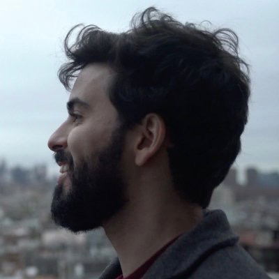

  

I'm Andre Ramaciotti.
You may also know me as *ars-dev-br,*
and I'm currently a senior software engineer at [Tremendous](https://www.tremendous.com).
Previously,
I worked at [AlphaSights](https://www.alphasights.com),
[CERTI](https://certi.org.br/en/),
and [Philips Healthcare](https://www.usa.philips.com/healthcare).

I've been working as a software engineer since 2010.
I've used a multitude of programming languages,
but lately I've been focusing on Ruby.
I also have an interest in Programming Languages as a study subject,
and I'm highly curious about Rust and Functional Programming in general.

Besides working as an engineer,
I'm also a registered accountant (in Brazil),
and I enjoy being a husband,
a father,
taking care of my ten cats,
reading,
gaming,
and playing the guitar.
If you think we should be in touch,
feel free to reach me out at <a href="mailto:blog@ars.dev.br">blog@ars.dev.br</a>.

## Posts
